# 🌐 Highly Available Web Infrastructure on Azure using Terraform

This project demonstrates how to provision a highly available infrastructure on Microsoft Azure using **Terraform**, an Infrastructure as Code (IaC) tool. The goal is to build a scalable and fault-tolerant environment to host a static website.

It features:
- Linux VMs across public/private subnets
- Azure Load Balancer with HTTP probe
- NAT Gateway for private subnet
- Apache Web Server with a personalized HTML page
- End-to-end automation and real infrastructure screenshots
This setup ensures traffic is distributed across instances for fault tolerance and better performance, while allowing web access through a secure and controlled network path.

### 1. Resource Group Created

**Terraform Output - Git Bash**

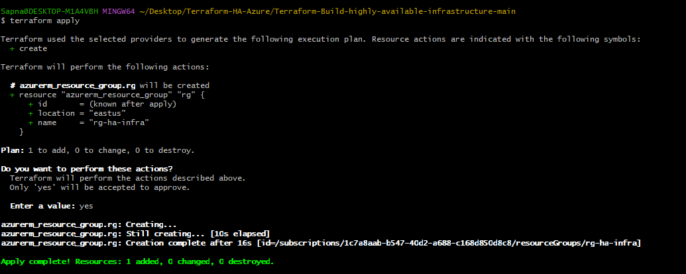

**Azure Portal Screenshot**

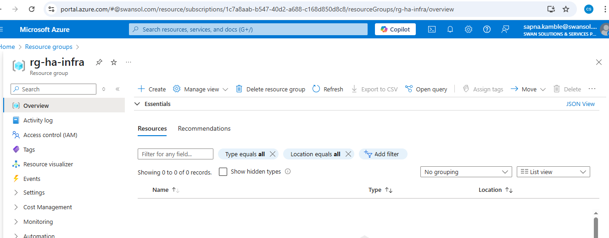

### 2. Create Virtual Network & Subnets

Terraform output:

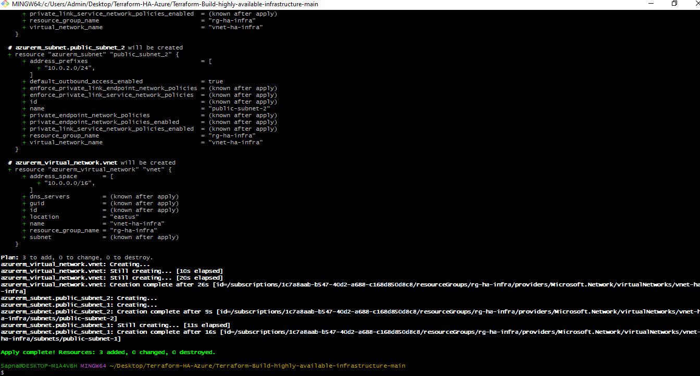

Azure Portal view:

### 3. Network Security Group (NSG) Configuration

- Created an NSG named `nsg-web` with rules to allow:
  - **HTTP (port 80)** for web access
  - **SSH (port 22)** for remote access

- Associated the NSG with the **public subnet** to protect and manage inbound traffic.

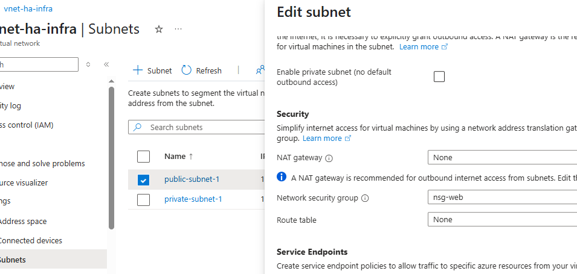

### 4. NAT Gateway – Private Subnet
   
To allow outbound internet access from the private subnet, a NAT Gateway was configured and associated with private-subnet-1.

This configuration allows Linux virtual machines (VMs) in the private subnet to:

Access the internet (for installing packages, updates, etc.)

Without exposing them to any inbound traffic (i.e., they are not directly reachable from the internet)

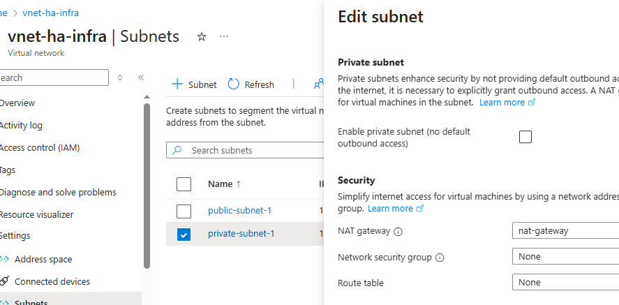

### 5. Deploy Linux VM in Public Subnet

To host a static website, a Linux Virtual Machine (Ubuntu) was deployed in `public-subnet-1`. The VM was configured using a custom cloud-init script (`custom_data`) that automatically installs and starts Apache.

**Key Configurations:**
- 🔐 SSH key generated via `tls_private_key`
- 🖥️ VM image: Ubuntu Server 18.04-LTS
- 🌐 Apache installed and started on boot
- 🔒 NSG (`nsg-web`) allows ports 22 (SSH) and 80 (HTTP)
- 🌍 Public IP assigned for external web access

📸 VM Overview with Public IP  
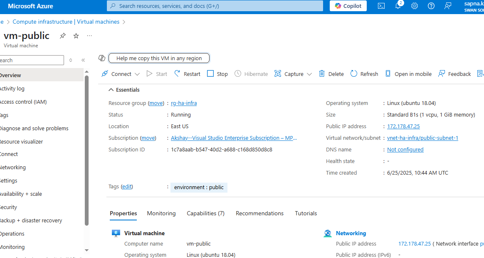

📸 Apache Web Server Default Page  
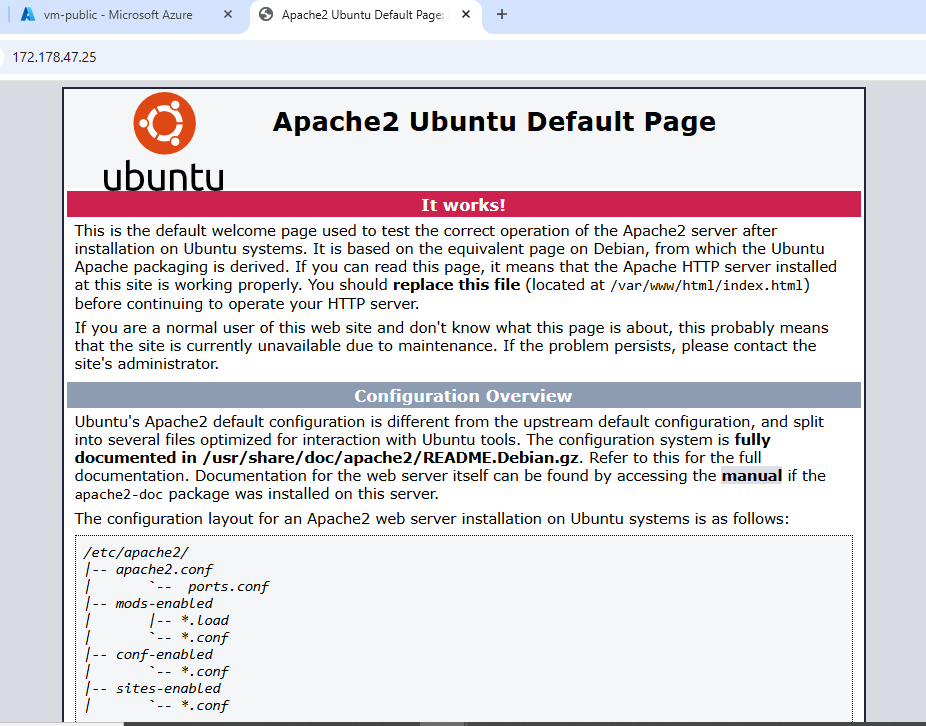

### 6. Private Linux VM – No Public Access

A second Ubuntu Linux Virtual Machine was deployed in the **private-subnet-1** without a public IP. This VM uses the NAT Gateway for outbound internet access, ensuring:

- **No direct inbound access from the internet**
- **Secure and controlled environment**
- Apache web server installed via cloud-init

**Terraform Git Bash Output**

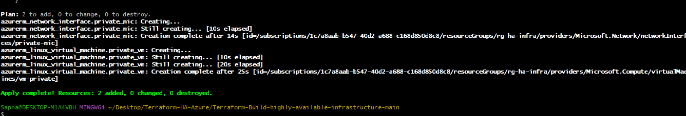

**Azure Portal – VM Networking Tab**

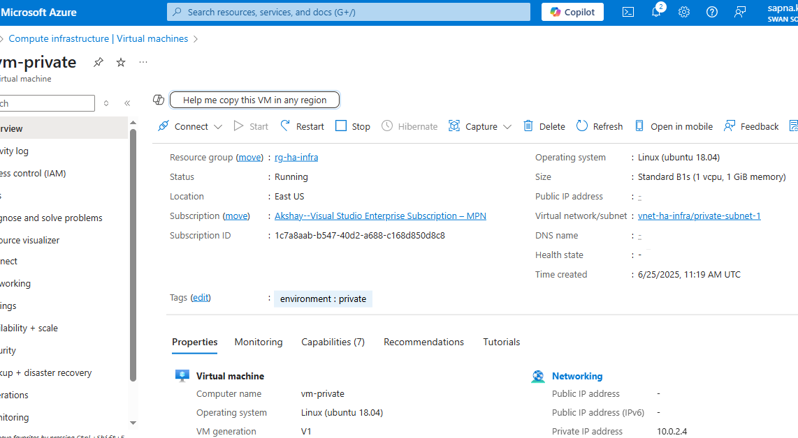

### 7. Azure Load Balancer Setup

To ensure high availability and distribute incoming traffic evenly across virtual machines, an Azure Load Balancer was created and configured.

**Key Components:**

- **Public IP**: Assigned to the Load Balancer for external access
- **Backend Address Pool**: Includes the NIC of the VM to receive traffic
- **Health Probe**: Checks HTTP port (80) to monitor backend VM health
- **Load Balancing Rule**: Routes incoming HTTP traffic to the backend pool

📸 **Terraform Plan and Apply Output**
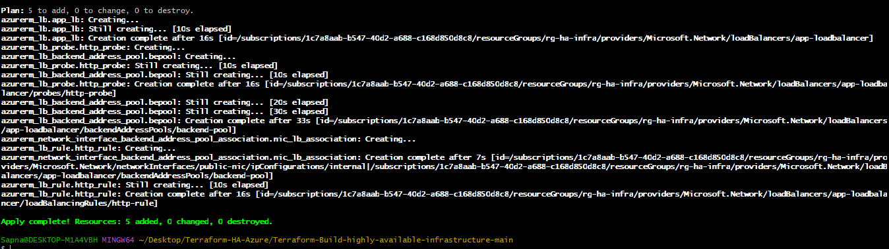

📸 **Load Balancer Configuration in Azure Portal**
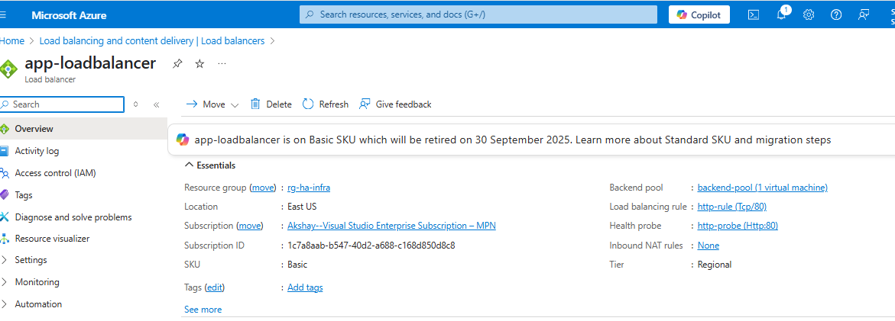

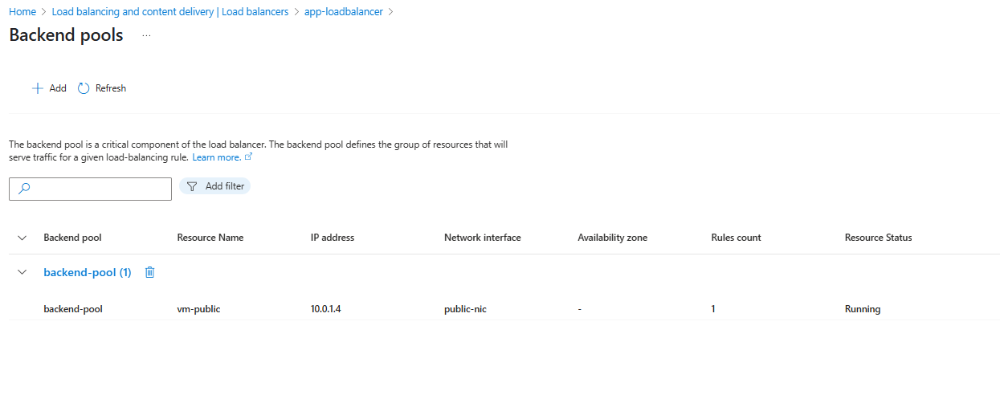.

### 8. Custom HTML Page with Developer Identity

To personalize the project and replace the default Apache page, a custom `index.html` was deployed using Terraform `custom_data`. It introduces the developer and describes the purpose of the project.

📸 Custom Apache Page with Developer Name

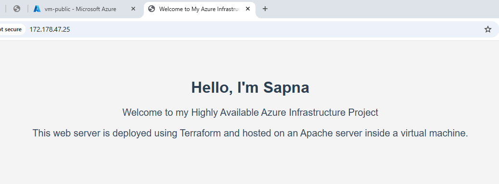

---

### 9.✅ Terraform Outputs

After successful execution of `terraform apply`, the following key outputs were returned:

- **Public VM IP Address**: Displays the public IP of the Linux VM in the public subnet.
- **Load Balancer Public IP**: IP through which the Load Balancer routes HTTP traffic to the backend.
- **Resource Group Name**: The name of the Azure resource group used to contain all resources.
- **Virtual Network Name**: The name of the virtual network created for this infrastructure.

📸 Screenshot: Terraform apply showing outputs  
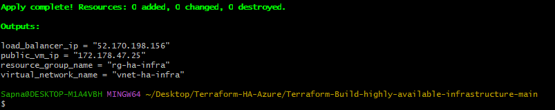

---

This confirms that all Azure infrastructure was successfully provisioned and is ready to serve a static web page via a highly available setup.

